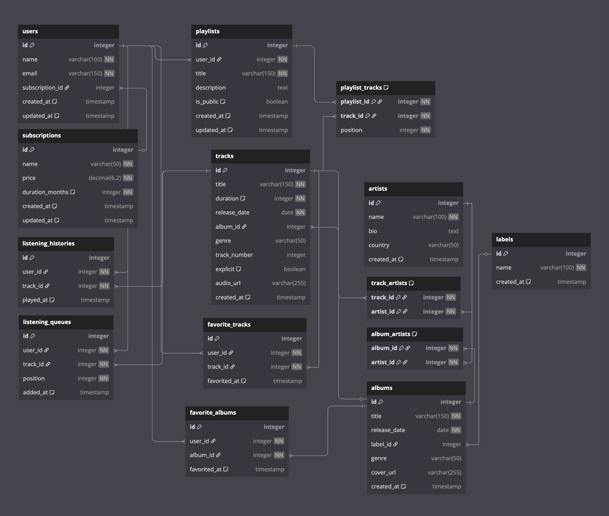

# Music Streaming Platform
- @Author: James Lindfors
- @Date: 5/2/2025
- @Last Updated: 5/11/2025

## Overview - Problem Statement
The goal of this project is to design a database schema for a music streaming platform. The platform allows users to listen to music, create playlists, and manage their listening habits. Users can subscribe to different plans, which determine their access level and billing rate. The platform also tracks user engagement and playback habits to provide personalized recommendations.

Each user on the platform has a subscription, which defines their access level and billing rate. Subscriptions can be shared across many users, but each user may only have one active subscription at a time. Users also have listening behaviors tracked by the system, including a personal listening queue (tracks they intend to listen to), a listening history (tracks they have played), and a library of content they have favorited.

A user may favorite either tracks or albums, and each favorite is time-stamped to reflect when it was added. A favorite may refer to either a track, an album, or both, but it is not required to include both.

Each user can also create multiple playlists. A playlist belongs to one user and contains a sequential list of tracks. Each track in a playlist is stored with its position in the list. A playlist may be marked as public or private, and includes a title and optional description.

The music itself is organized into tracks, albums, artists, and labels:

Each track has metadata including title, duration (in seconds), release date, genre, and a flag to indicate if the content is explicit. It may optionally belong to an album but can also exist as a single. Each track must have at least one artist but may have multiple, such as in a collaboration. These artist-track relationships are stored in a join table.

Tracks may be grouped into albums, and each album can have multiple tracks. Albums also have associated metadata such as release date, genre, and cover image. Albums are produced by labels, with each label capable of releasing many albums. An album may also feature multiple artists. Just like tracks, the many-to-many relationship between albums and artists is stored in a separate join table.

Artists can appear on many albums and many tracks. Each artist has a name, an optional biography, and an associated country of origin.

The listening queue for a user contains an ordered list of tracks. Each track in the queue is assigned a position, indicating its order in playback. New tracks added to the queue are timestamped. The listening history logs when users have played specific tracks, recording both the user and the timestamp of the interaction.

Each record label has a unique identity and may be responsible for many albums and, by extension, many tracks. Labels do not own artists directly, but artists may appear on multiple albums across different labels.

The platform tracks user engagement and playback habits in order to support features such as personalized recommendations and public playlists. The database must be able to store detailed metadata about music content, support many-to-many relationships between entities (such as artists and tracks), and record temporal events like listening activity and content favoriting.

## Preliminary ERD 


## Final ERD



> 3NF normalized schema

## Solution Analysis

The database design for the music streaming platform follows best practices of relational database modeling, ensuring normalization up to the Third Normal Form (3NF). By organizing tables based on core entities such as users, tracks, artists, albums, and playlists, the design effectively reduces redundancy and maintains data integrity. The many-to-many relationships, such as between tracks and artists or users and playlists, are managed through intermediary tables, ensuring efficient data storage and retrieval. This relational structure allows for the easy extension of the system, whether to accommodate additional features such as podcast integration or to scale up for millions of users and tracks.

The queries provided align with the use cases of a typical music streaming platform. They enable tracking of user behavior, such as the most played tracks or recently favorited songs, and allow for generating personalized data insights, such as the most recent track played or a breakdown of tracks by genre within a playlist. These queries are optimized to ensure high performance, with considerations for grouping, filtering, and ordering data to return meaningful insights efficiently. Overall, the solution strikes a balance between complex data relationships and the practical needs of a music streaming platform, ensuring the database is both scalable and capable of handling real-time interactions.

## Queries

### Get the artists from the tracks in the playlist

```sql
select 
    a.name as artist_name,
    t.title as track_title,
    p.title as playlist_title
from 
    playlists p
inner join 
    playlist_tracks pt on p.id = pt.playlist_id
inner join 
    tracks t on pt.track_id = t.id
inner join 
    track_artists ta on t.id = ta.track_id
inner join 
    artists a on ta.artist_id = a.id
where 
    p.id = 1  -- Playlist Id 
order by 
    a.name, t.title;
```
This query retrieves a list of artists from the tracks in a specific playlist. It joins several tables: playlists, playlist_tracks, tracks, track_artists, and artists. The results show each artist’s name alongside the track title and the playlist they belong to. The DISTINCT keyword ensures that each artist's name appears only once per track. This query is useful for displaying all artists in a particular playlist.

### Get the most played tracks by genre

```sql
select 
    t.genre, 
    t.title as track_title,
    count(lh.id) as play_count -- Count times track has been played
from 
    listening_histories lh
inner join 
    tracks t on lh.track_id = t.id
where 
    t.genre is not null
group by 
    t.genre, t.title
having 
    count(lh.id) > 0
order by 
    play_count desc
limit 10;
```
This query counts how many times each track was played, grouping them by genre. It uses the listening_histories table to count occurrences of each track being played. The HAVING clause ensures that only tracks with at least one play are included. The result is ordered by play count in descending order, showing the top 10 most-played tracks by genre.

### Get user's listening history, track's artist, and most recent track played

```sql
select 
    distinct u.name as user_name,
    t.title as track_title,
    a.name as artist_name,
    lh.played_at
from 
    listening_histories lh
inner join 
    users u on lh.user_id = u.id
inner join 
    tracks t on lh.track_id = t.id
left outer join 
    track_artists ta on t.id = ta.track_id
left outer join 
    artists a on ta.artist_id = a.id
where 
    u.id = 1
    and lh.played_at = (
        select max(played_at)
        from listening_histories
        where user_id = u.id
    )
    and t.title is not null
order by 
    lh.played_at desc;
```
This query retrieves the most recent track played by a specific user, along with the artist of the track. It uses a subquery to find the most recent play (max(played_at)) for the user. The query also joins the listening_histories, users, tracks, and artists tables to retrieve the track title, artist name, and play time.

### Get tracks in a playlist by genre and count of tracks per genre

```sql
select 
    t.genre,
    count(t.id) as track_count
from 
    playlist_tracks pt
inner join 
    tracks t on pt.track_id = t.id
where 
    pt.playlist_id = 1
    and t.genre is not null
group by 
    t.genre
having 
    count(t.id) > 1
order by 
    track_count desc;
```
This query returns the count of tracks in a specific playlist, grouped by genre. It filters for genres that have more than one track, providing a breakdown of the diversity within a playlist based on genres. The query is useful for understanding the distribution of genres within a playlist.

### Get tracks a user has favorited in the past 7 days

```sql
select 
    distinct u.name as user_name,
    t.title as track_title,
    ft.favorited_at
from 
    favorite_tracks ft
inner join 
    users u on ft.user_id = u.id
inner join 
    tracks t on ft.track_id = t.id
where 
    u.id = 1
    and ft.favorited_at between (current_date - interval '7 days') and current_date
    and t.title is not null
order by 
    ft.favorited_at desc;
```
This query retrieves tracks that a specific user has favorited in the past 7 days. It filters the favorite_tracks table by the favorited_at timestamp, ensuring only recent favorites are included. The result provides the track title and the favorited timestamp, ordered by the most recent favorites.

## Indexes

### Optimize Query for Recently Favorited Tracks

#### Query
```sql
-- Get tracks a user has favorited in the past 7 days
select ...
from favorite_tracks ft
inner join users u on ft.user_id = u.id
...
where ft.favorited_at between (current_date - interval '7 days') and current_date
```

#### Index
```sql
create index idx_favorite_tracks_user_date 
on favorite_tracks(user_id, favorited_at);
```

This index will speed up queries filtering on both `user_id` and `favorited_at`. 

It allows the database to:

- Quickly locate favorites for a specific user
- Efficiently filter those by a time range using BETWEEN.

### Optimize Listening History by Track and Genre
#### Query
```sql
-- From: Get the most played tracks by genre
select t.genre, t.title, count(lh.id)
from listening_histories lh
inner join tracks t on lh.track_id = t.id
group by t.genre, t.title
having count(lh.id) > 0
```
#### Index
```sql
create index idx_listening_histories_track 
on listening_histories(track_id);
```

This index optimizes the `INNER JOIN` between the `listening_histories` and tracks tables. Since `track_id` is being used as a foreign key and join condition, indexing it:

- Speeds up access to the track data,
- Improves the efficiency of grouping by genre and counting plays.

